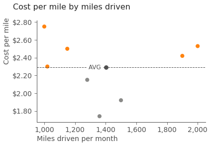

# Data Storytelling

Telling good data stories requires good data visualisations, using color, annotations and such to attract the reader's attention on the important aspects of the data.

A good book to learn this skill is ["Storytelling with Data" by Cole Nussbaumer Knaflic](http://www.storytellingwithdata.com/). Since her book is tool agnostic, and my main tool in data science for data exploration is Python, I made for myself a few templates for reproducing a handful of figures from the book using matplotlib. Matplotlib code can look complex but it is simple once you get the gist of it. It is perfect for storytelling with data because it is very flexible and gives a lot of control over each element in a figure. In particular, color and annotations are key.

Here are the figures I made with Matplotlib:

#### Area graph

#### Bar graph

#### Heatmap graph

#### Line graph

#### Scatter plot

#### slope graph

